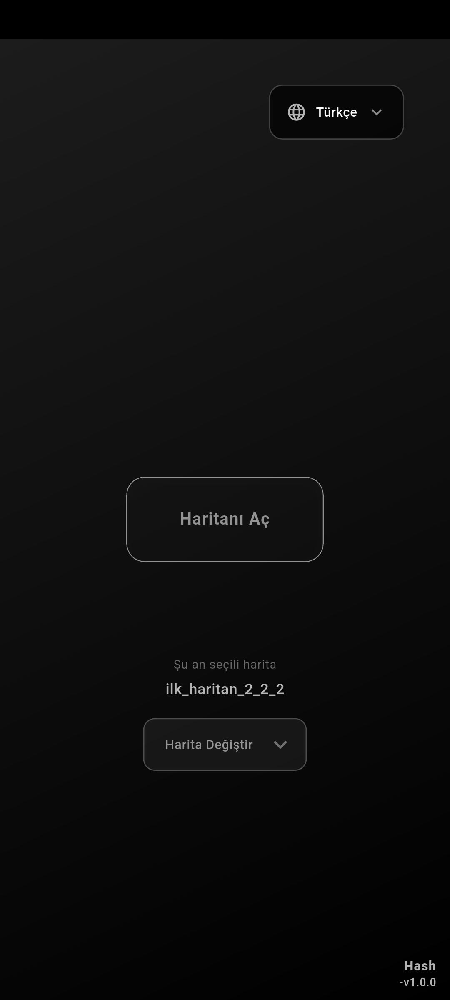
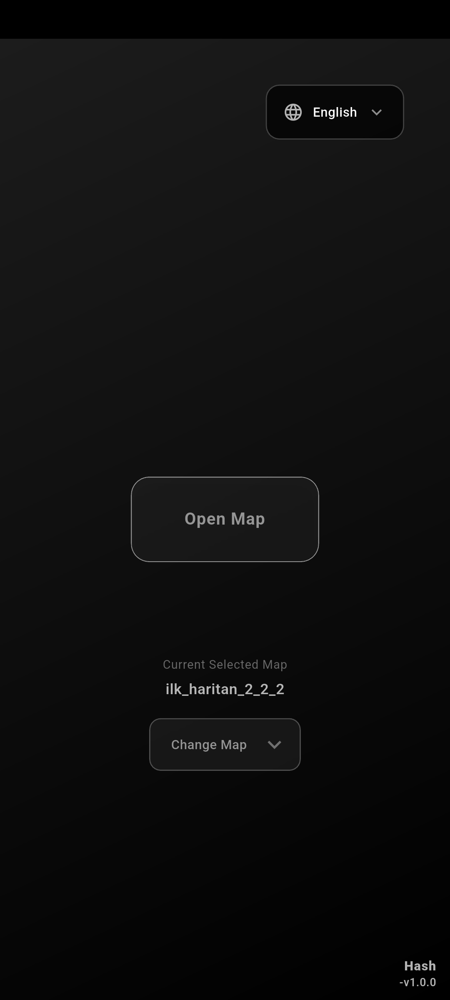
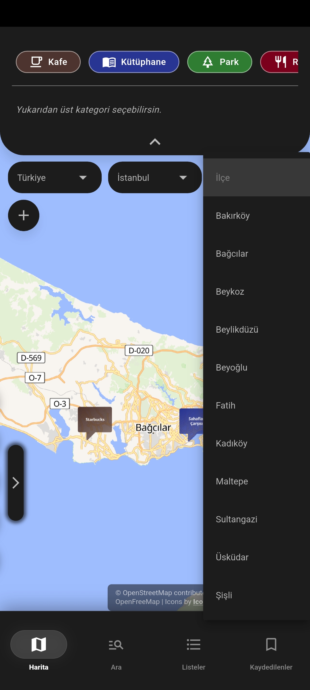
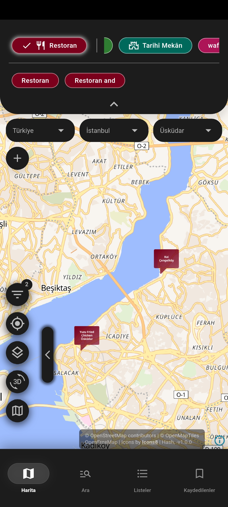
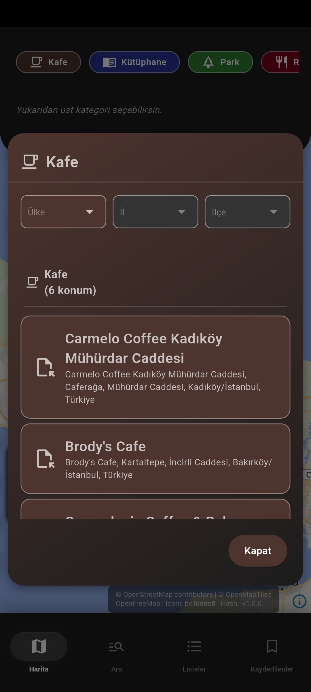
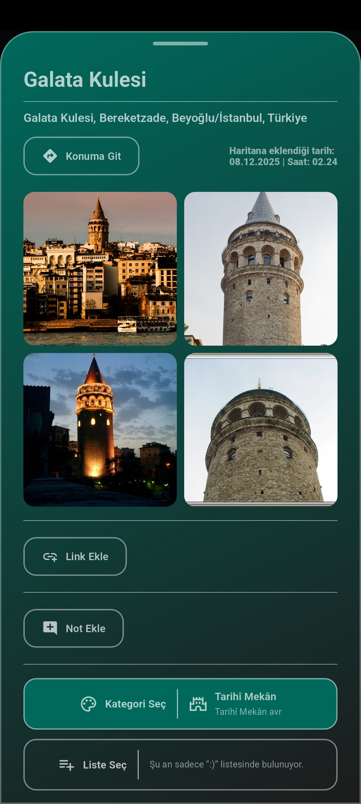
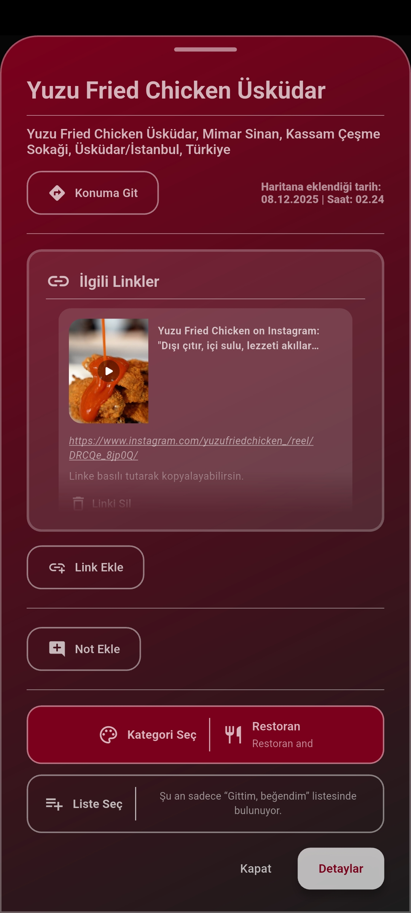
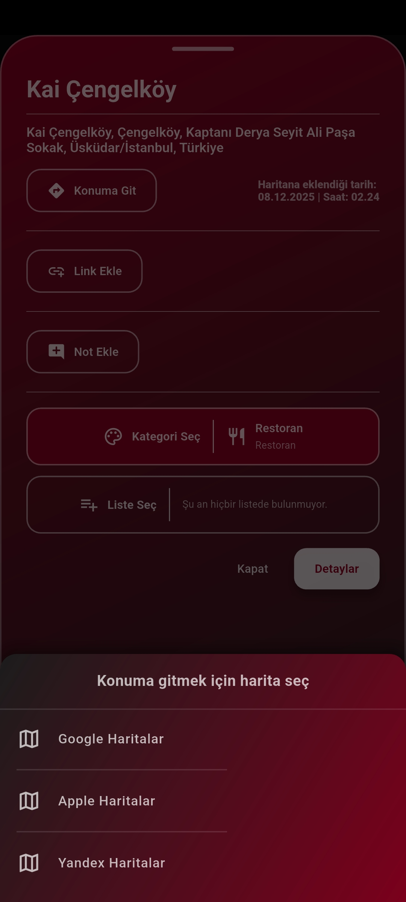
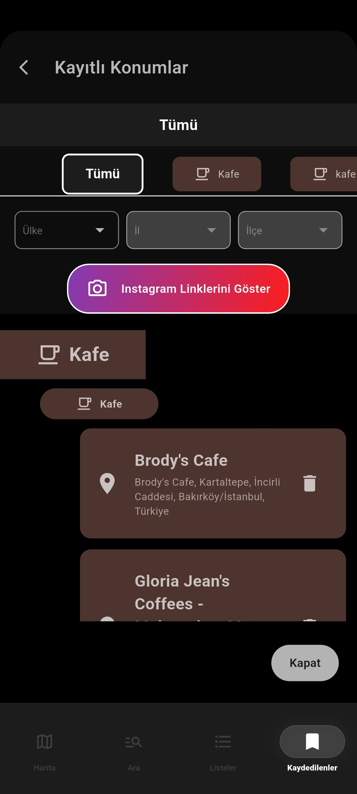
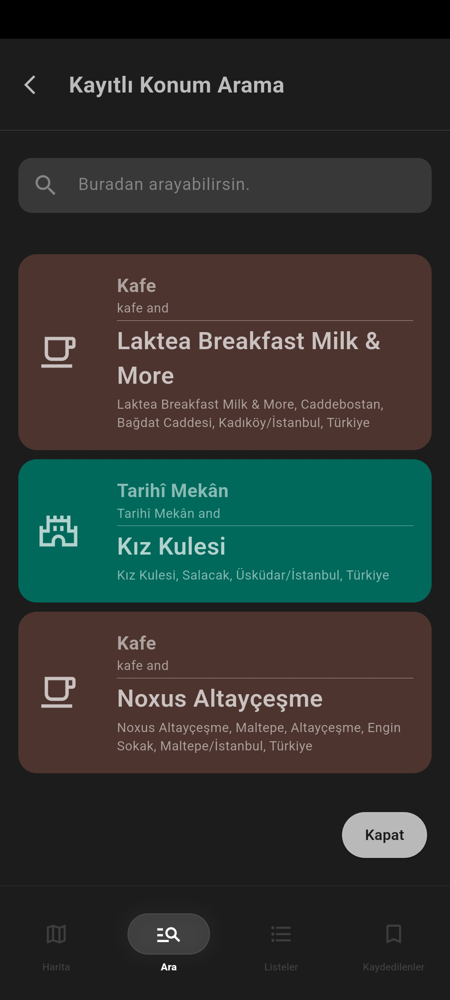

# Reelize

  <i>Your private, offline-first personal mapping and location management experience.</i>

---

## Overview

**Reelize** is a beautifully crafted, offline-first mobile application built with Flutter. It allows users to pinpoint, categorize, and manage their favorite locations locally. Designed with privacy and performance in mind, Reelize operates independently of continuous network connectivity, utilizing local JSON storage for a blazing-fast, seamless experience.

*Note: This repository serves as a product and UI/UX showcase. The source code is maintained privately.*

---

## Showcase & User Journey

### 1. Welcoming Experience (Bilingual Onboarding)
A smooth, localized onboarding flow welcoming users in multiple languages right out of the box. The application fully supports both languages.

  
  &nbsp;&nbsp;&nbsp;&nbsp;
  

### 2. Map & Exploration
Experience a fluid, custom map interface. Users can easily filter their view by specific areas and categories (e.g., *Üsküdar & Restaurants*) or dive into quick categorizations via dynamic popups.

  
  &nbsp;&nbsp;&nbsp;&nbsp;
  
  &nbsp;&nbsp;&nbsp;&nbsp;
  

### 3. Rich Location Details
Reelize goes beyond simple coordinates. Location detail sheets support rich media, including photo galleries, automatic link previews for websites, and integrated navigation actions.

  
  &nbsp;&nbsp;&nbsp;&nbsp;
  
  &nbsp;&nbsp;&nbsp;&nbsp;
  

### 4. Organization & Search
Manage hundreds of saved spots effortlessly. Users can browse their complete location lists, utilize the powerful local search functionality, and keep their spatial data perfectly organized.

  
  &nbsp;&nbsp;&nbsp;&nbsp;
  

---

## Technical Highlights

- **Framework:** Flutter / Dart
- **Map Rendering:** MapLibre GL for highly customizable and performant vector mapping.
- **Architecture:** Offline-First Approach
- **Data Persistence:** Local JSON File Storage
- **UI/UX:** Custom bottom sheets, dynamic chips, and rich media handling (Link Previews, Image Galleries).

---

  Made by Hash.

